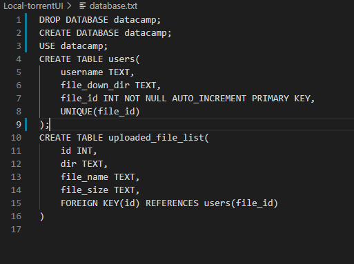
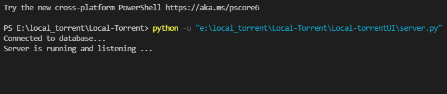
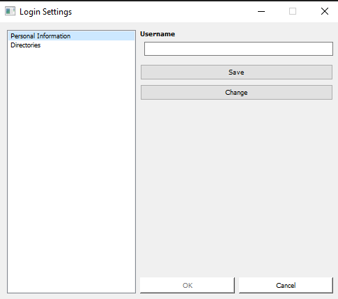
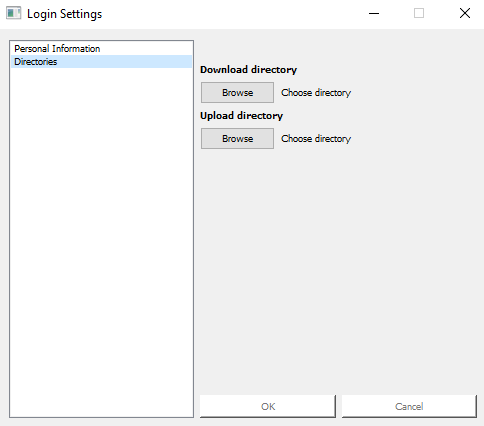
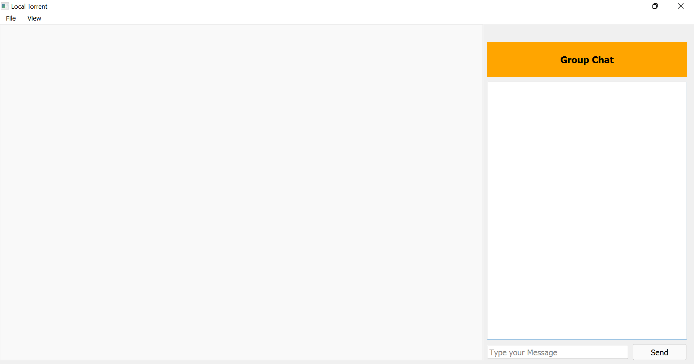
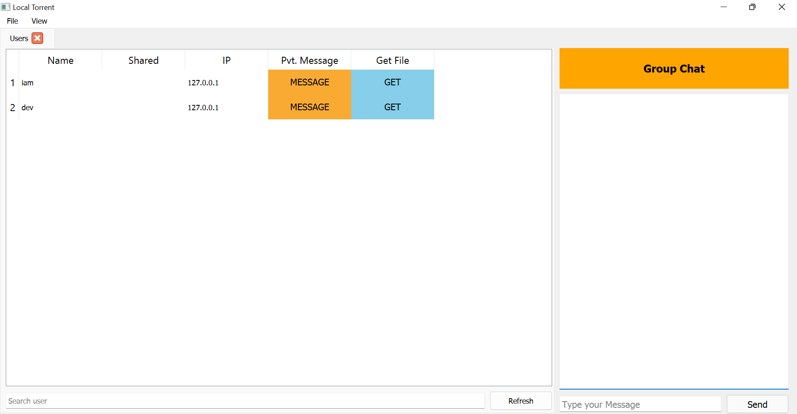
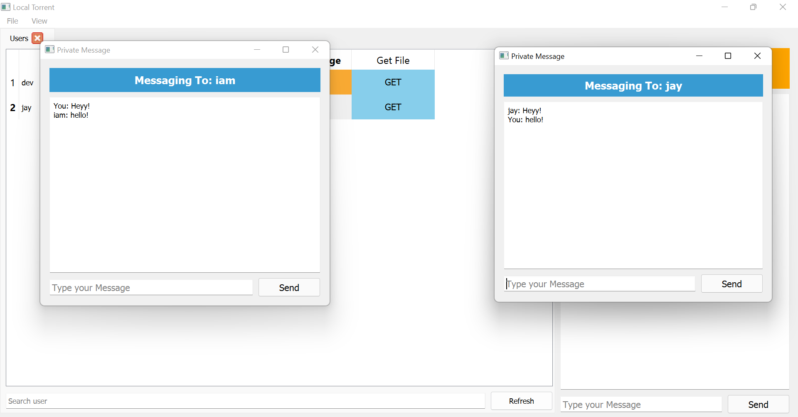
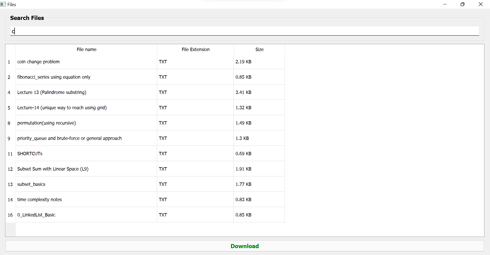
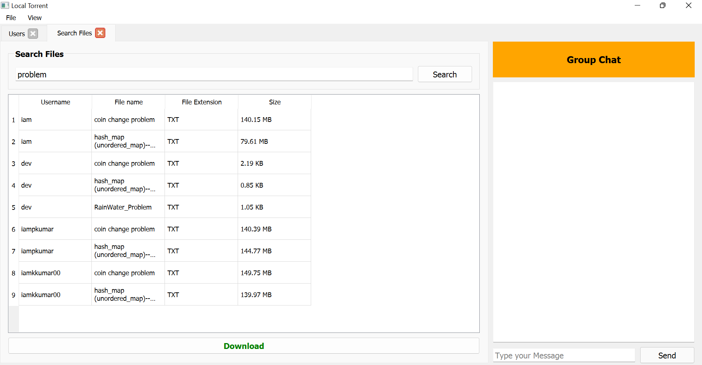
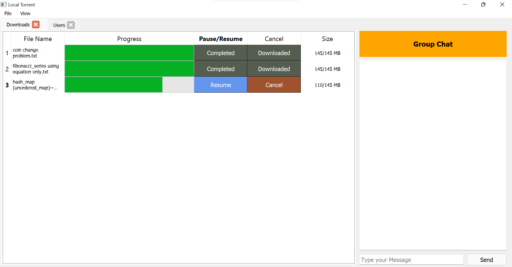

# Local-Torrent (Based On DC++)
## What is DC++?
  - DC++ is a desktop application that runs on intra-network and replicates the features of torrent.The application uses various networking concepts and
    algorithms to achieve the best file transfer speed possible in peer to peer, one peer to multiple peers and multiple peers to one peer communications.
    The application will be able to run on the college network for chatting and file-sharing purposes. 
    
## Technologies Used:
  -  `(3.9.0)`
  -  `(5.15.4)`
  - `Socket Programming`

## Features Implemented:
  - Sharing Files
    - Files can be shared from one peer to another. Basically every connected (to server) user open a port for sharing the file on their device.
    - If any other user wants to download the file, server will send the `IP address` and `Port` to the user whoever has that file and using this IP address and port, the user will connect and send the needed file.
    - This sharing is done from `peer to peer`.
  - Group Chat
    - Here the user need to type and send the message. The message will be sended to server.
    - Server send the message to all users who are connected at same time.
  - Private Messaging
    - User has to select a user from the listed users and can send the messages.
    - This communication is also done by server.

## Local Setup
  ### For Server:
  - Firstly the need is to create a database. The sql script for creating the database is in the `database.txt` file inside the local-torrentUI folder.
 
    
    
  - Now to install dependencies you need to type `pip install dotenv` in the command prompt.
  - Next create a .env file containing the password of your database in the format - `password="your_password"`.
  - Now run `server.py` file in Local-torrentUI.
   
   
  
  ### For Client
  (If you are running multiple users on the same device, then comment the line having `self.file_socket()`. If you are not doing this, then it will throw error as it means you are opening the same port multiple times on the same device)
  - Make sure the server is running.
  - For `new user`
    - Firstly the user needs to run the `login_typo.py` file.    
    - The user will be directed to a pyqt5 application in which the user will have to enter the
    details regarding his username (each user will have a unique username). Along with this the user will also be required to select the upload and download directory from his computer.  
    
        
    
    - After this the information will be stored in the database. Now the user will be able to open the application.
    
  - For `existing users`  
    - Directly run the `main_UI1.py` file and the user will be able to see main page of the application.
   
  - The following is the main page of the application. The right panel can be used for group chatting with all the other active users:  
    
    
    
  - Now by selecting `users` from the menu, the other active users can be seen. Private messaging along with file downloading can be done with other active users.
      
    
  
  - By double clicking on `Message` corresponding to the user. Here is a image for private chatting between two users
   
    
    
  - By double clicking on the `GET` button, the user can fetch all the files that have been shared by the corresponding user. Or directly search file in search tab.
  
    
    
    
    
  - After selecting the files, click on the `Download` button, now the user can see the `Downloads` in the download tab. While downloading, the user can pause, resume or cancel the downloading.  
      
    

## Contributors:
  - `Prashant Kumar(2020IMG-050)`
  - `Devansh Agarwal(2020IMG-020)`
