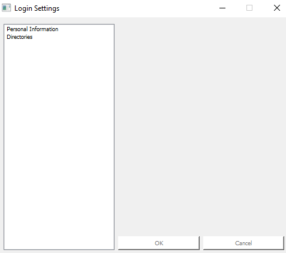
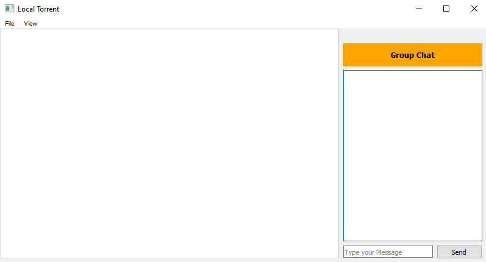
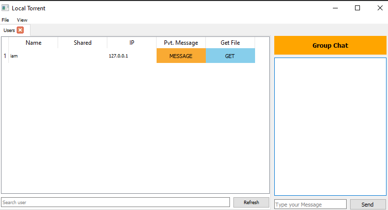
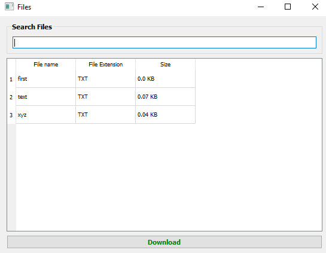
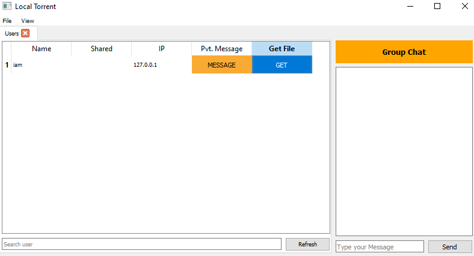

# DC++
  - What is DC++?
    - DC++ is a desktop application that runs on intra-network and replicates the features of torrent.The application uses various networking concepts and
      algorithms to achieve the best file transfer speed possible in peer to peer, one peer to multiple peers and multiple peers to one peer communications.
      The application will be able to run on the college network for chatting and file-sharing purposes. 
  
  - How to use the application?
    - Firstly the need is to create a database. The sql script for creating the database is in the `database.txt` file inside the local-torrentUI folder.   
      
    - Now to install dependencies you need to type `pip install dotenv` in the command prompt.
    - Next create a .env file containing the password of your database in the format - `password="your_password"`.
    - Now while running the software for the first time, first run the server by running the server.py file.  
      
    - Once the server is running, the user needs to run the `login_typo.py` file. The user will be directed to a pyqt5 application in which the user will have to enter the
      details regarding his username (each user will have a unique username). Along with this the user will also be required to select the uplad and download directory from his 
      computer.  
      
      
      
    - After this the information will be stored in the database. Now the user will be able to open his DC++ application. The following is the main page of the application.
      The left panel can be used for group chatting with all the other active users:    
      
    - Now by selecting `users` from the menu, the other active users can be seen. Private messaging along with file downloading can be done with other active users.    
      
    - By clicking on the `GET` button, the user can get all the files that have been shared by the other user.  
      
    - Also by clicking on the `Download` button corresponding 
      to a partiular file, the user can download that file and he will automatically be redirected to the `Downloads` tab. While downloading, the user can pause or resume 
      the downloading if he wants to do so.  
      
      
  - Technologies Used:
    - 
    - 
    - `Socket Programming`
  - Contributors:
    - `Prashant Kumar(2020IMG-050)`
    - `Devansh Agarwal(2020IMG-020)`
